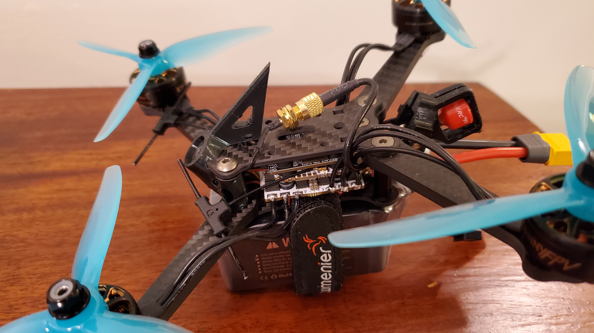

# AERIS
Currently, this is a dump of what I've picked up for my open-ended drone project. I'm not completely sure where I want to go with this project. I'm interested in digging into AM32 and Ardupilot. For now, I want to be able to fly well manually.

I'm using Liftoff simulator ([https://www.liftoff-game.com](https://www.liftoff-game.com)) to practice before flying the real thing. It works well with the Radiomaster Boxer controller via USB. Drone footage coming soon.

   

## Parts List
### Drone
| Item | Qty | Price | Seller |
|---|---|---|---|
| [Lumenier N2O Feather-Lite 1550mAh 6s 150c Lipo Battery (XT-60) - 3 Pack Bundle](https://www.getfpv.com/lumenier-n2o-feather-lite-1550mah-6s-150c-lipo-battery-xt-60-3-pack-bundle.html) | 1 | $267.99 | getfpv |
| [Lumenier Indestructible Kevlar Lipo Strap - 20x250mm (3pcs)](https://www.getfpv.com/lumenier-indestructible-kevlar-lipo-strap-20x250mm-3pcs.html) | 1 | $10.99 | getfpv |
| [Lumenier 2307 JohnnyFPV V3 Pro Cinematic Motor](https://www.getfpv.com/lumenier-2307-johnnyfpv-v3-pro-cinematic-motor.html) | 4 | $135.96 | getfpv |
| [SMA to U.FL Cable 50mm](https://www.getfpv.com/sma-to-ufl-cable-50mm.html) | 1 | $4.49 | getfpv |
| [TrueRC Singularity 5.8 SMA Long Antenna (RHCP)](https://www.getfpv.com/truerc-singularity-5-8-sma-long-antenna-rhcp.html) | 1 | $19.99 | getfpv |
| [Ruko R111/R111S Remote ID Module](https://www.ruko.net/products/ruko-r111-remote-id-module?srsltid=AfmBOoof1hLb1IN1zczKCgDyu2UWk-7EgX1FXkC_JhjSH9QIy0290Hfu&variant=44906840752297) | 1 | $39.99 | Ruko |
| [HDZero Nano 90]() | 1 | $59.99 | HDZERO |
| [HDZero Race V3 VTX](https://hdzero.us/products/hdzero-race-v3-vtx?_pos=1&_sid=90f309246&_ss=r) | 1 | $64.99 | HDZERO |
| [HDZero Halo Stack](https://hdzero.us/products/hdzero-halo-stack?_pos=1&_sid=7af36d8c0&_ss=r) | 1 | $142.99 | HDZERO |
| [UMMAGRIP - Universal Super Sticky Battery Pad](https://ummagawd.com/products/ummagrip-battery-pad) | 1 | $4.99 | UMMAGAWD |
| [ZigZag 5" Racing Frame w/ 45Degree Nano90 Upgraded Lens](https://flyfive33.com/products/five33-zigzag-5-racing-frame?variant=50566409290022) | 1 | $46.99 | FIVE33 |
| [Gemfan Hurricane V2 Tri-Blade 5.1" Propeller (Pack of 16pcs)](https://www.amazon.com/dp/B09QGL3MTZ) | 1 | $18.99 | Amazon |
Subtotal: $818.35
### Tools

| Item | Qty | Price | Seller |
|---|---|---|---|
| [VIFLY ShortSaver 2 - Smart Smoke Stopper XT60 + XT30](https://www.getfpv.com/vifly-shortsaver-2-smart-smoke-stopper-xt60-xt30.html) | 1 | $18.96 | getfpv |
| [BAT-SAFE](https://www.bat-safe.com/product-page/bat-safe) | 2 | $159.98 | BAT SAFE |
| [HDZero Goggle 2](https://hdzero.us/products/hdzero-goggle-2?_pos=1&_sid=5c82fe7c4&_ss=r) | 1 | $779.99 | HDZERO |
| [HDZero VTX Programmer](https://hdzero.us/products/hdzero-vtx-programmer?_pos=1&_sid=9d7615ee2&_ss=r) | 1 | $16.99 | HDZERO |
| [HOTA D6 Pro Lipo Charger](https://www.amazon.com/dp/B0827S7NYV?ref_=pe_148126100_1193965070_t_fed_asin_title) | 1 | $106.49 | Amazon |
| [Radiomaster Boxer Radio Control 2.4G 16ch Hall Gimbals Transmitter 4in1 ELRS CC2500 Version Support EDGETX (ELRS Mode 2)](https://www.amazon.com/dp/B0DXZW5R51) | 1 | $179.99 | Amazon |
| [RADIOMASTER SoloGood 7.4V 2S 6200mAh Large Capacity Rechargeable Lipo Battery with XT30 JST-XH Connector Compatible Boxer TX16S Transmitter RC Car Drone Controller](https://www.amazon.com/dp/B0BR3V5SRW) | 1 | $45.18 | Amazon |
Subtotal: $1307.58